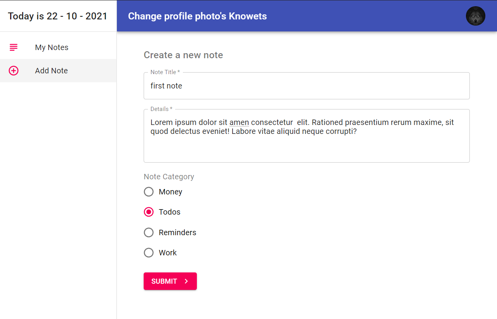
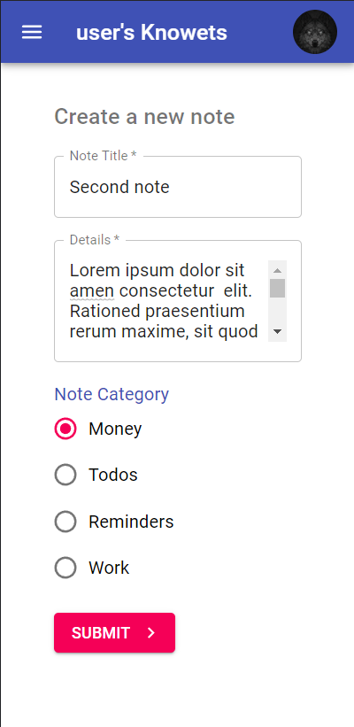
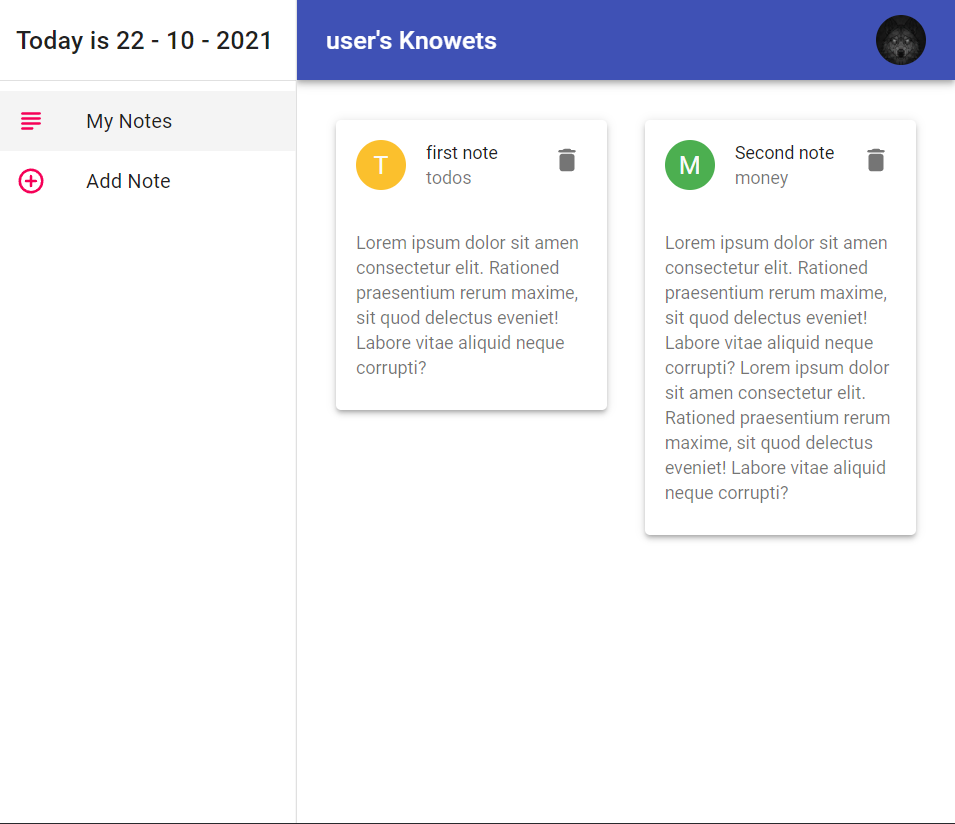
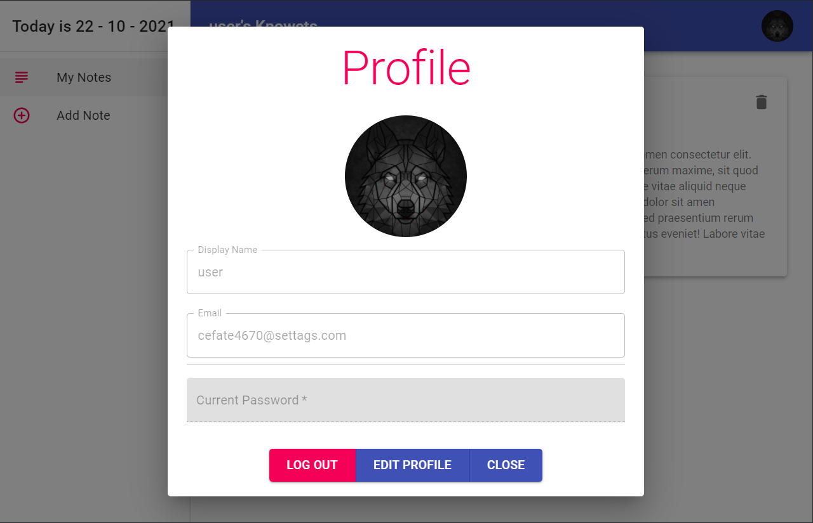

 
    
    <h3 align="center">knowtes</h3>
    
<a href="https://knowtes.vercel.app/">DEMO</a>

## About The Project

A simple and easy-to-use note-taking app with user authentication, designed for the person who wants to access their notes at any time from any of their favorite devices.

## Technologies Used

-   [Reactjs](https://reactjs.org/docs/getting-started.html)
-   [react-router](https://reactrouter.com/)
-   [MATERIAL-UI](https://v4.mui.com/)
-   [firebase](https://firebase.google.com/)
-   [react-masonry-css](https://github.com/paulcollett/react-masonry-css#readme)

## Screenshots

## Features

-   Fully Responsive design
-   Authentication and authorization of the user
-   Editable User Profiles
-   User data security
-   Form validation

## Lessons Learned

-   Used environment variables for effectively hiding details
-   Worked with Firebase for authentication, storage and database.
-   Effectively used MATERIAL-UI for great boilerplate of modern web apps and responsive design
-   Made a good looking card arrangement with the help of react-masonry-css

## Upcoming Features

-   Ability to update notes
-   Dark mode toggle

## Feedback

If you have any feedback, please reach out to me at [linkedin](https://www.linkedin.com/in/dubey-aman/)
